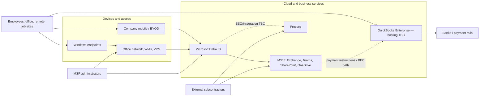

# Conceptual Environment and Trust Relationships

This diagram is a **scenario model**, not an observed network topology. Exact integrations, data flows, authentication paths, and segmentation remain unknown.

## Assessment focus points

- Identity is a shared control plane for corporate and potentially project services.
- Email crosses into the high-integrity vendor-payment process.
- External parties need project access but create lifecycle and sharing risk.
- MSP access may bridge multiple systems and requires separate governance.
- Job-site/BYOD access extends beyond the controlled office boundary.
- QuickBooks hosting and technical dependencies must be discovered before architecture conclusions are drawn.

