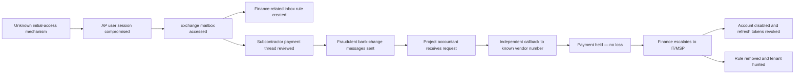
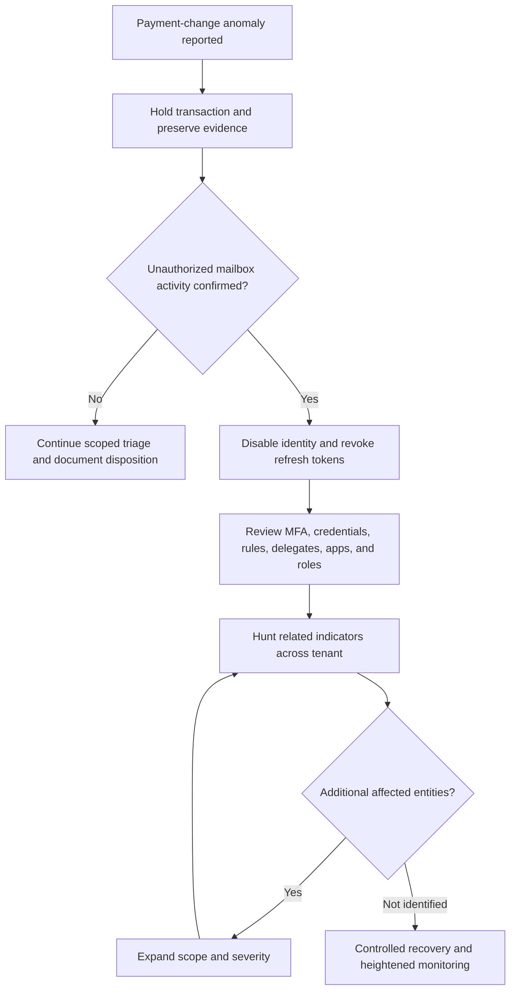
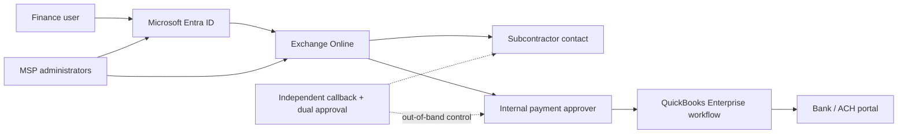

# Architecture and Incident Flow

All entities and flows are simulated.

## Business email compromise path

## Response decision flow

## Key trust boundary

The payment-verification control is deliberately outside the email trust path. A compromised mailbox therefore cannot, by itself, authorize a destination change.
